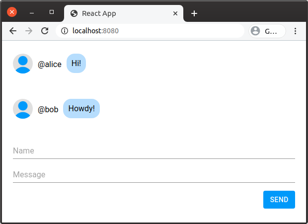
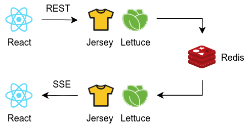

# Demo for JAX-RS/SSE and Redis Pub/Sub 

A simple chat application demostrating the usage of the SSE (Server-Sent Events) API of JAX-RS and Redis Pub/Sub via Lettuce.



## Architecture



## Building application

Make sure that JDK and Maven are set up.

```
% java --version
openjdk 11.0.2 2019-01-15
OpenJDK Runtime Environment 18.9 (build 11.0.2+9)
OpenJDK 64-Bit Server VM 18.9 (build 11.0.2+9, mixed mode)
```

```
% mvn --version
Apache Maven 3.6.3 (cecedd343002696d0abb50b32b541b8a6ba2883f)
Maven home: /opt/apache-maven-3.6.3
Java version: 11.0.2, vendor: Oracle Corporation, runtime: /opt/jdk-11.0.2
Default locale: en_US, platform encoding: UTF-8
OS name: "linux", version: "5.3.0-51-generic", arch: "amd64", family: "unix"
```

Clone the repository and move current directory.

```
% git clone git@github.com:wgag/chat-sse-redis.git
% cd chat-sse-redis
```

Build the application by Maven.

```
% mvn package
```

The application is generated at the following path.

```
target/chat.jar
```

## Running application

Before starting the application run Redis.

```
% docker run -p 6379:6379 redis:6.0.1
```

Run the application.

```
% java -jar target/chat.jar
```

Open http://localhost:8080/ in your web browser, then you'll get the chat UI.

## See also

The chat UI made by React is based on the following article.

*  [1時間でリアルタイムチャットを作る（React + FireBase + Material UI） - Qiita](https://qiita.com/classfox/items/c27be0162076dd4bf539)
